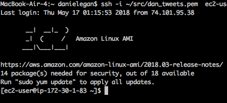

# Step 1: Setting up EC2
The first step is setting up an EC2 instance on AWS. If you're not familiar with EC2, here is a good [tutorial](https://www.datacamp.com/community/tutorials/aws-ec2-beginner-tutorial) of what it is and does. 

## Launching an instance
I used a Linux AMI because I'm used to Mac's command line interface, so the guide below is for the Linux models. 

You'll definitely want to launch a free teir instance: we're not doing heavy computing here, and it's free! 
  
  Make sure you save down your keys somewhere you can find them. You'll need them shortly.

## Setting up the instance
First, you'll need to install R on the instance, and it's nice to get the updated version. 

I use [iterm3](https://www.iterm2.com/) as my command-line-interface (CLI), so the screenshots will be from there.

### Logging into your EC2 instance
You'll need to ssh into your EC2 instance from iTerm (or your CLI). For me, this is a command like this

```bash
ssh -i ~/src/dan_tweets.pem  ec2-user@##.##.##.###
  ```

the `ssh -i` is the command, the first argument `~/src/dan_tweets.pem` is where your EC2 pem key is located on your computer, and the final argument `ec2-user@##.##.##.###` is the login name and web address of your EC2 instance. 

You know you'll be successfully logged in because you'll see a screen like this one:  
  
  

### Install R

This installs R onto the EC2 instance
```bash
sudo yum -y install R
```

In order to use internet functions like `install.packages()` in `R`, you'll want to update the EC2 instances web libraries. 

I followed the instructions from [here](https://stackoverflow.com/questions/20923209/problems-installing-the-devtools-package) and got it working. I just needed to:

```bash
sudo yum -y install libcurl libcurl-devel
sudo yum -y install openssl-devel
chmod 7503
```
Then I could use `R` packages like [devtools](https://github.com/r-lib/devtools). 

## Getting your credentials file onto the EC2 instance. 
There are two ways I know of to get your `twitter_credentials.yaml` file onto an EC2 instance: copy/paste and file transfer. 


First, I had some issues editing the cron file, or more specifically _having my edits save_. I had to do this: 

```bash
export EDITOR=nano
sudo nano crontab -e
```


#### Copy/Paste
When ssh'd into your EC2 instance, use the nano text editor to create a new yaml file in `/src/`.
```bash
sudo nano twitter_credentials.yaml
--- in nano, paste credentials ---
```
> In nano, to save the changes you've made, press Ctrl + O. To exit nano, type Ctrl + X. If you ask nano to exit from a modified file, it will ask you if you want to save it. Just press N in case you don't, or Y in case you do. [source](https://wiki.gentoo.org/wiki/Nano/Basics_Guide#Saving_and_exiting). 

Make sure you have proper indentation! 


## Managing your `tweet_db` and `schedule` on the EC2 instance

How do you get new content into your tweet_db, or change your schedule? One way is to do a nightly run via crontab pulling through a web-based service like github, dropbox, or S3. 

## Using a package
I ended up creating a data package to manage my content and scripts. You can see it [here](https://github.com/bestdan/dpegantwitlib). The upside is that it's github-managed. 
I put my bash files in `inst/exdata/`. 

For example, if you keep your `schedule` and `tweet_db` in a github repo called dpegantwitlib in your crontab file, include a line: 

```bash
05 01 * * * sudo sh ~/src/my_tweet_objects/update_repo.sh
```

Where `update_repo.sh` just does:  

```bash
#!/bin/bash
git pull origin master
```


So my EC2 crontab looks like
```crontab
00 01 * * * sudo sh src/tweets/update_repo.sh
*/5 * * * * sudo sh src/tweets/run_crontwit.sh
```
